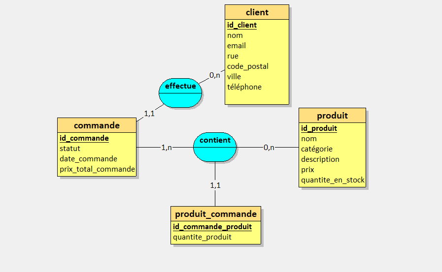
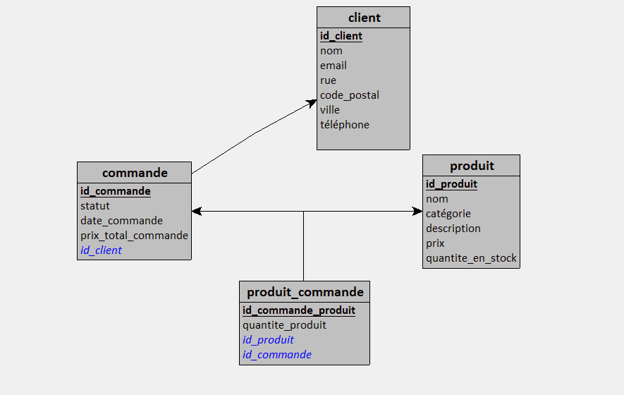
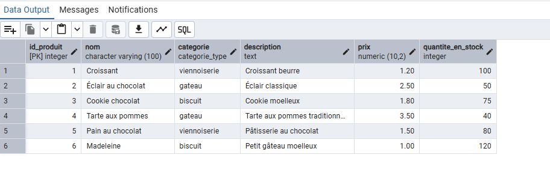
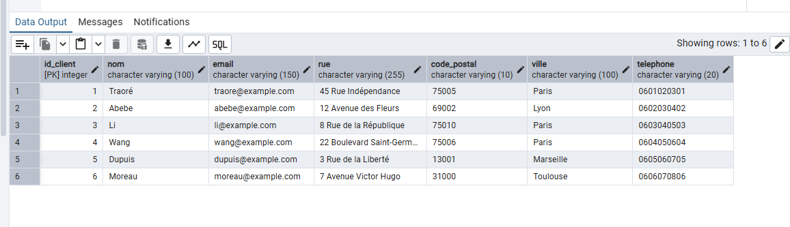
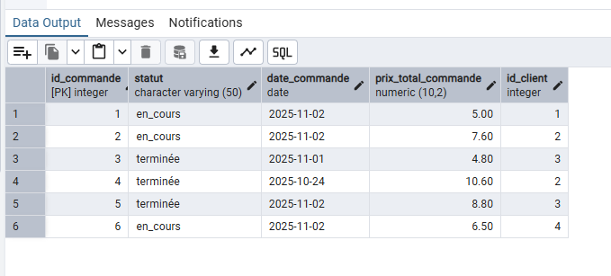
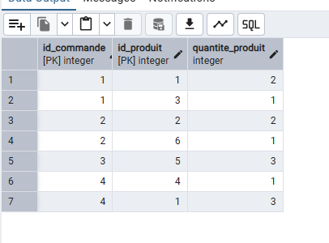
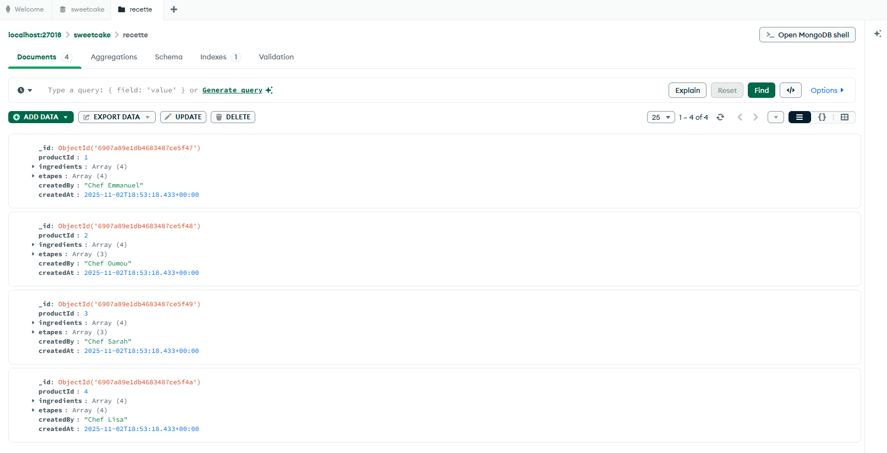
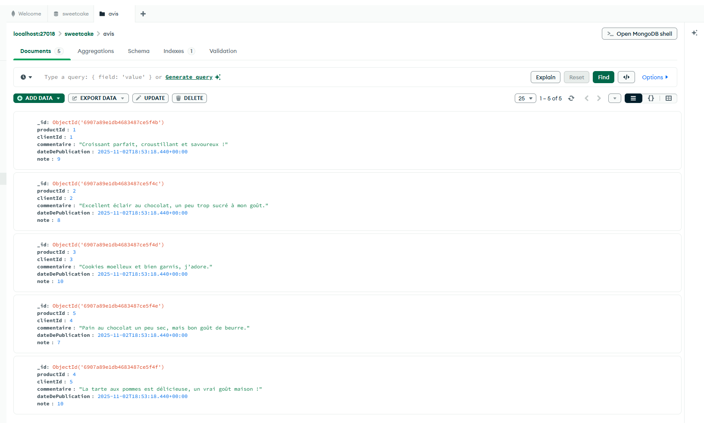

# Projet Final - Base de Données Relationnelles et Non Relationnelles

## Membres du groupe

**Emmanuel Prime**
**Touré Oumou**

## 1.Présentation du projet

Dans le cadre du projet en **Bases de Données Relationnelles et Non Relationnelles**, le choix de notre application s’est porté sur une **application de gestion d’une mini-pâtisserie en ligne**. Celle-ci a pour objectif de dynamiser le travail des entreprises évoluant dans le secteur de la pâtisserie, grâce à ses nombreuses fonctionnalités. Elle permettra notamment : 
    - **une gestion des produits (pâtisseries)**, 
    - **une gestion des commandes**, 
    - **une gestion de la clientèle**, 
    - **ainsi qu'une vue d’ensemble sur les statistiques de vente et de production de l’entreprise**.

## 2.Architecture PostgreSQL (Méthode Merise)

Afin de mener à bien notre projet, La conception du **modèle conceptuel de données (MCD)** a été réalisée en premier lieu dans le but de représenter les entités marquantes de notre application et leurs relations. Ce modèle a ensuite servi de base à la construction du **modèle logique (MLD)** et du **modèle physique (MPD)**, nécessaires à la création de nos tables dans **PostgreSQL**. 

- ### Schéma de la Modélisation Conceptuel des Données

- ### Schéma de la Modélisation Conceptuel des Données

- ### Modèle Physique des Données

Vous trouverez le script complet de la création de nos tables (**le Modèle Physique des Données**) dans le fichier: [Création des tables en Postgres](init-postgres/gestion_patisserie.sql).

## 2.1.Insertion des données dans nos tables en PostgreSQL

Le script complet de l'insertion des données dans nos différentes tables est présent dans le fichier suivant: [Insertion des données dans nos tables](init-postgres/gestion_patisserie.sql).

- **Affichage du résultat de l'insertion depuis pgAdmin**

 

 
 

## 2.2.Opérations de CRUD sur nos tables

Les opérations de CRUD et de jointures effectuées sur chacune de nos tables en PostgreSQL se trouve dans le fichier suivant: [Opérations de CRUD sur nos tables](init-postgre/gestion_patisserie.sql).

## 2.3.requêtes complexes

Les requêtes complexes qui ont quant à elle permis d’extraire des informations consolidées, d’effectuer des calculs, des regroupements sur nos tables PostgreSQL se trouvent dans le fichier suivant : [Requêtes complexes sur nos tables](api/src/index.js).

## 3.Architecture MongoDB

Pour la partie MongoDB, vous trouverez dans ce fichier: [Création des collections en MongoDB](init-mongo/collections.js) la structure de nos différents documents et la logique d’initialisation de la base MongoDB utilisée dans notre application. 

Cette base est une extension de notre application de gestion d'une mini patisserie en ligne. Associée à notre base de données en PostgreSQL, elle permet, à partir des deux collections créées **recettes** et **avis** de: 

 - **Stocker les recettes** associées aux produits. Chaque client peut donc consulter une recette avant l'achat d'un produit et prendre connaissance des ingredients en cas d'allergies.

 - **Regrouper les commentaires et notes des clients** sur les différentes pâtisseries, afin de permettre des améliorations continues de la qualité des productions.

Vous pourrez retrouvez ci-dessous les captures d'écran respectives des collections qui ont bien été crées en MongoDB: 

 

## 3.1.Création de documents en MongoDB

Le script complet de création de documents pour nos collections est présent dans le fichier suivant: [Création des documents](init-mongo/collections.js).

- **Affichage du résultat de la création de documents depuis MongoDB Compass**

  
 
 

## 3.2.Opérations de CRUD sur nos tables

Les opérations de CRUD et d'agrégations effectuées sur chacune de nos collections en MongoDB se trouve dans le fichier suivant: [Opérations de CRUD sur nos collections](init-mongo/collections.js).

## 3.3.requêtes complexes

Les requêtes complexes quant à elle sont présentes dans le fichier suivant : [Requêtes complexes sur nos collections](init-mongo/collections.js).

## 4.Justification des choix techniques

## 4.1.Choix de PostgreSQL/MongoDB

Pour notre application de pâtisserie, nous avons réparti les données selon leur nature :

**PostgreSQL** gère les informations structurées et relationnelles, comme les clients, produits et commandes.
Ces entités sont fortement liées entre elles et nécessitent de la cohérence (par exemple, une commande est toujours associée à un client et à un ou plusieurs produits). PostgreSQL est donc l’outil que nous avons jugé adapter pour garantir l’intégrité et la fiabilité de ces données grâce à ses relations et transactions.

**MongoDB**, de son côté, stocke les données non structurées, comme les recettes et les avis clients. Elles ne nécessitent pas de relations complexes et elles sont moins critiques que les données transactionnelles donc moins d’inquiétude en cas de pertes.

## 4.2.Choix de modélisation MongoDB

Après avoir consulter le fichier [Création des documents](init-mongo/collections.js), vous remarquerez que le choix de la modélisation MongoDB pour notre application a été basée sur un modèle par référencement. Les collections **recette** et **avis** utilisent des champs comme **productId** et **clientId** qui font référence aux produits et aux clients dans la base PostgreSQL.

On a fait ce choix surtout pour éviter de dupliquer les données, parce que les informations principales comme les produits, les clients ou les commandes sont déjà dans PostgreSQL. Ça permet aussi d’avoir des documents plus légers et faciles à maintenir.

Pour la collection avis, par exemple, chaque commentaire d’un client est lié à un produit via productId, ce qui nous évite de stocker toutes les infos du produit dans l’avis. De même, pour les recettes, elles sont associées aux produits sans recopier toutes les données. Ce modèle est donc plus flexible, surtout quand les données deviennent complexes et qu’on peut avoir plusieurs avis ou recettes pour un même produit.

## 4.3.Communication entre les deux bases

Dans notre application, les deux bases de données, PostgreSQL (relationnelle) et MongoDB (NoSQL), communiquent grâce à une **API REST** que nous avons développée avec Node.js et Express. Par exemple, lorsqu’un client consulte une recette ou un avis, l’API récupère les informations de MongoDB via des requêtes sur les collections recette et avis.

Lorsqu’une commande est passée, l’API écrit les informations dans PostgreSQL (commandes et commandes_produits) et peut mettre à jour MongoDB si nécessaire.

Vous retrouverez tous les fichiers de la créations de notre api dans ce dossier: [Création d'une API REST](api/).

## 5.Stratégie de sauvegarde 

Pour la sauvegarde de notre base de données en MongoDB, on a opté pour une sauvegarde complète avec à partir de la commande suivante: **mongodump --uri="mongodb://localhost:27017" --db=sweetcake --out=/backup/mongodb** et une restauration coplète avec mongostore: **mongorestore --uri="mongodb://localhost:27017" --db=sweetcake /backup/mongodb/sweetcake**. 

Quant à la sauvegarde de notre base de données PostgreSQL, nous avons choisi d’utiliser une **sauvegarde complète avec pg_dump**, ce qui nous permet de générer un fichier SQL contenant toutes les structures et données de la base : **pg_dump -U admin -d sweetcake -F c -f /backup/postgres/sweetcake.backup** et une restauration avec pg_restore: **pg_restore -U admin -d sweetcake /backup/postgres/sweetcake.backup**.